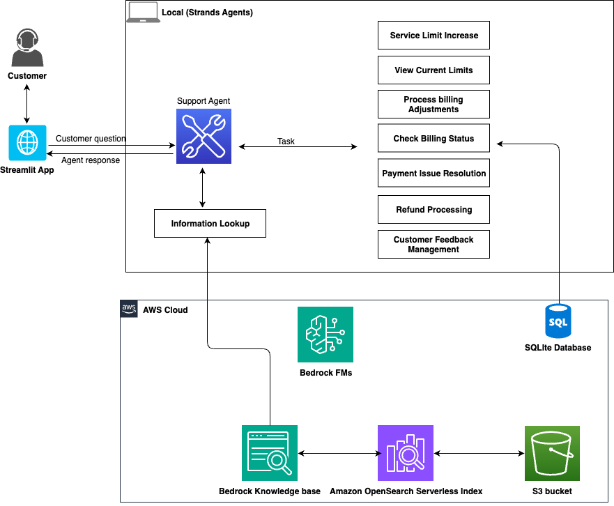

# Build generative AI-powered customer support agent using Amazon Strands Agent and Amazon Bedrock

## Overview

This project demonstrates the construction of an advanced customer support agent using Amazon Strands Agent and Amazon Bedrock. It focuses on developing tools to automate various customer support tasks, enhancing efficiency and response times.

### Key Features

- 🔍 Information Lookup (retrieve)
- 📈 Service Limit Increase (increase_limit)
- 👀 View Current Limits (view_customer_limits)
- 💰 Process Billing Adjustments (adjust_billing)
- 📊 Check Billing Status (view_customer_billing)
- 🛠️ Payment Issue Resolution (resolve_payment_issue)
- 💸 Refund Processing (process_refund)
- 📝 Customer Feedback Management (manage_customer_feedback)

## Solution Components

- Amazon Strands Agent for tool automation
- SQLite integration for operational data management
- Amazon Bedrock Knowledge Base for comprehensive troubleshooting information

## Prerequisites

1. **Infrastructure Setup**
   - Deploy the CloudFormation template (`supportAgent_cf.yml`) to create:
     - S3 bucket
     - VPC with public and private subnets
     - IAM roles for SageMaker and Bedrock Knowledge Base
     - OpenSearch Serverless Collection
     - SageMaker domain and user profiles

2. **Knowledge Base Setup**
   - Execute `KBTroubleshooting.ipynb` to:
     - Create vector index in the collection
     - Establish Bedrock Knowledge Base
     - Set up data source and ingestion job

3. **Access Requirements**
   - Bedrock Models: Anthropic Claude Sonnet 3
   - Python packages: boto3, requests_aws4auth, strands-agents, strands-agents-tools, streamlit
   - SQLite database

## Project Structure

- `CustomerSupport.ipynb`: Main notebook for customer support operations
- `app.py`: Streamlit application for user interface
- `billing_adjust_tool.py`: Tool for processing billing adjustments
- `customer_feedback_tool.py`: Tool for managing customer feedback
- `limit_increase_tool.py`: Tool for handling limit increase requests
- `payment_issue_tool.py`: Tool for resolving payment issues
- `refund_processing_tool.py`: Tool for processing refunds
- `view_billing_tool.py`: Tool for viewing billing information
- `limit_db.py`: Database management for customer limits
- `utility.py`: Utility functions for the application

### Data Files
- `billing_data.json`: Sample billing data
- `customer_supportdata.json`: Additional customer support data
- `limit_data.json`: Data related to customer limits
- `troubleshooting_kb.txt`: Knowledge base content for troubleshooting
- `kb_id.txt`: File storing the Knowledge Base ID

### Database
- `customer_support.db`: SQLite database file for customer support data

### Infrastructure
- `supportAgent_cf.yml`: CloudFormation template for infrastructure setup

## Setup and Usage

1. Deploy the CloudFormation template (`supportAgent_cf.yml`) to set up the required infrastructure.

2. Run `KBTroubleshooting.ipynb` to set up the Bedrock Knowledge Base.

3. Execute `CustomerSupport.ipynb` to interact with the customer support agent and test various tools.

4. (Optional) Run the Streamlit application:

## Purpose

This solution provides a practical, versatile framework for teams to create customized agents tailored to specific applications and products. It offers an intuitive approach to support agent development, focusing on automating manual tasks and improving customer service efficiency.

